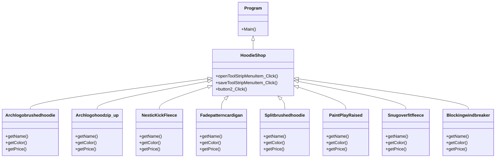

# FinalProject

```mermaid
classDiagram
    Program <|-- HoodieShop
    HoodieShop <|-- Archlogobrushedhoodie
    HoodieShop <|-- Archlogohoodzip_up
    HoodieShop <|-- NesticKickFleece
    HoodieShop <|-- Fadepatterncardigan
    HoodieShop <|-- Splitbrushedhoodie
    HoodieShop <|-- PaintPlayRaised
    HoodieShop <|-- Snugoverfitfleece
    HoodieShop <|-- Blockingwindbreaker
    Program : +Main()
    class HoodieShop{
        +openToolStripMenuItem_Click()
        +saveToolStripMenuItem_Click()
        +button2_Click()
    }
    class Archlogobrushedhoodie{
        +getName()
        +getColor()
        +getPrice()
        
    }
    class Archlogohoodzip_up{
        +getName()
        +getColor()
        +getPrice()
    }
    class NesticKickFleece{
        +getName()
        +getColor()
        +getPrice()    
    }
    class Fadepatterncardigan{
        +getName()
        +getColor()
        +getPrice()
    }
    class Splitbrushedhoodie{
        +getName()
        +getColor()
        +getPrice()
    }
    class PaintPlayRaised{
        +getName()
        +getColor()
        +getPrice()
    }
    class Snugoverfitfleece{
        +getName()
        +getColor()
        +getPrice()
    }
    class Blockingwindbreaker{
        +getName()
        +getColor()
        +getPrice()
    }
```
